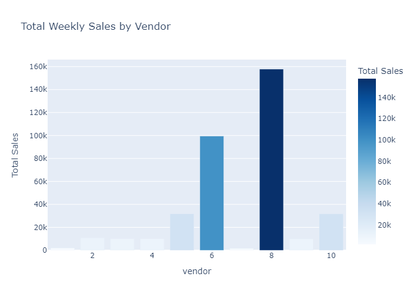
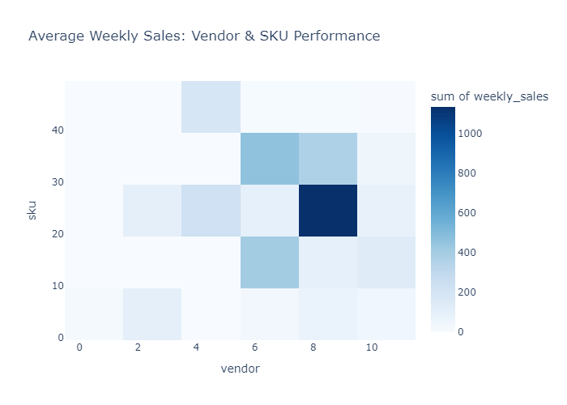
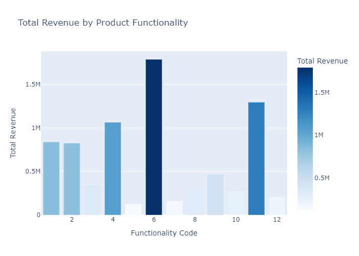
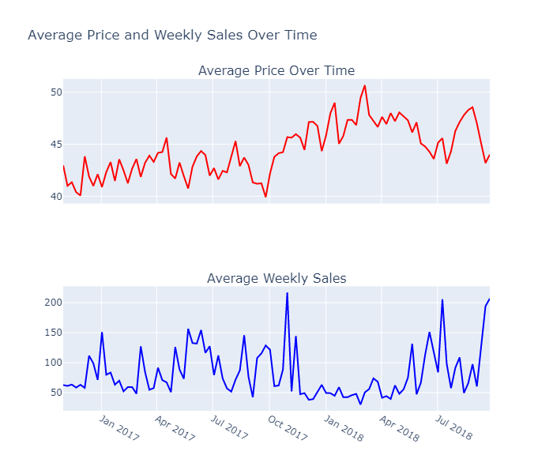
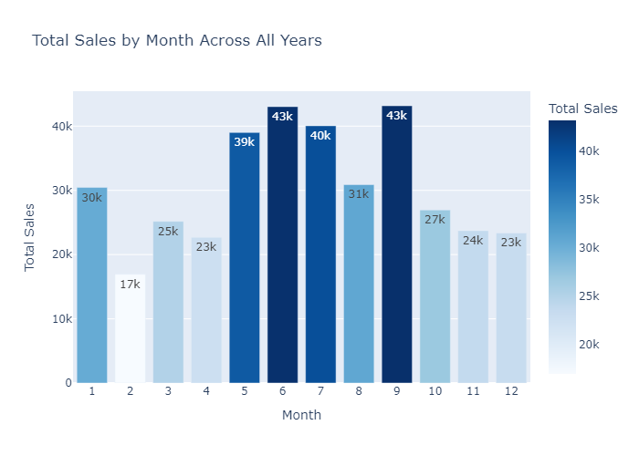
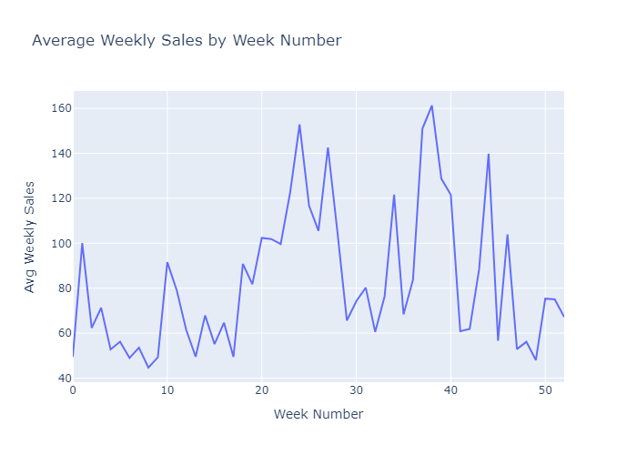

# Project Background
Micro Center, founded in 1979, is a U.S.-based electronics retailer known for its wide selection of computer hardware and consumer electronics. While the company has maintained strong in-store sales, rising competition from online-first retailers like Amazon and Newegg has pressured Micro Center to extract more value from its internal sales data to remain competitive in the evolving retail landscape.

With large volumes of historical sales data at the weekly SKU level, this project aims to uncover key performance insights that can support smarter pricing, promotion, and vendor strategies. Micro Center’s leadership has tasked the team with analyzing trends and identifying actionable insights. Micro Center has provided a limited dataset to evaluate the team's ability to generate actionable insights. If the initial findings demonstrate potential for a positive return on investment, a proposal for continued collaboration and expanded analysis will be considered.

Insights and recommendations are provided on the following key areas:

  * Sales Trends Analysis: Identifying historical weekly sales patterns and revenue changes across time to uncover seasonality, sales dips, or growth windows.

  * Price & Promotion Effects: Measuring how featured placements and price shifts affect weekly performance at the product level.

  * Vendor & SKU Performance: Highlighting which vendors consistently deliver high-performing products — and which may be underperforming.

  * Product Functionality Insights: Understanding which categories (e.g., mobile accessories, PC parts) drive the most volume and revenue.

  * Optimization Opportunities: Offering strategic next steps to improve revenue, pricing, or promotional efficiency.

The SQL queries used to inspect and clean the data for this analysis can be found here [https://github.com/SuaveAnalyst/microcenter-stakeholder-report/blob/b4c8adfa755217263b653f0d71de3bfcf86ba541/Micro%20Center%20SQL%20Ad-Hoc%20Report#L26-L175]

Targeted SQL queries regarding various business questions can be found here [https://github.com/SuaveAnalyst/microcenter-stakeholder-report/blob/de6da56e4cca384a817f6a4cacbc569685e0122c/Micro%20Center%20SQL%20Ad-Hoc%20Report#L318-L343]

# Business Questions Visualized
***Price & Promotion Effects***
 * 1.) Are promotional features (main page placements) driving higher sales volumes?
   
  
  
**"The distribution of weekly_sales is right-skewed for both groups, but the Promo group shows more high-end outliers. This suggests that main page promotions not only boost average sales but can also trigger occasional spikes in demand."**
  
  

  **"The bar chart shows the average weekly sales for both promoted and non-promoted products. Products featured on the main page had nearly twice the average weekly sales compared to those that weren’t promoted. This provides a clear indication that promotional placement has a positive impact on overall sales performance."**
    
***Vendor & SKU Performance***
 * 2.) Which vendors consistently provide top-performing products?

   

    **"Vendor 8 stands out as the top performer, generating the highest total weekly sales by a significant margin, followed by Vendors 6 and 5. This suggests that Vendor 8 consistently supplies high-demand products and may be a strong candidate for expanded partnerships or promotional focus. Further analysis of SKU-level performance within these vendors could help pinpoint the drivers of this success."**

   

    **"Vendor 8 not only leads in total sales but also consistently supports high-performing SKUs—particularly SKU 30, which shows the strongest sales intensity overall. This indicates that Vendor 8 delivers both volume and reliability, making it a key contributor to revenue."**

***Product Functionality Insights***
 * 3.) What product functionalities drive the most revenue?

   

    **"The box plot shows how much money each product makes within each functionality. Here, Functionality 11 stands out because its individual products tend to earn more, even if it doesn’t sell as many."**

   

    **"Functionality 6 is winning by volume (lots of products selling steadily), while Functionality 11 is winning by product strength (fewer products, but stronger performance per item)."**

***Sales Trends Analysis***
 * 4.) How does product price impact weekly sales performance over time?

   

    **"While average prices steadily rise, weekly sales show an inverse pattern at key points. For example, during periods where price dips slightly, such as in late 2017 and summer 2018, sales surge — suggesting a negative price elasticity, where lower prices drive higher sales."**

***Sales Trends Analysis***
 * 5.) What are the peak sales periods across the year?

   

    **“Sales peak mid-year, especially from May to September, making this the most profitable season. In contrast, February and Q4 show consistently lower sales, suggesting opportunities for targeted campaigns or off-season promotions to drive volume during slow periods.”**

   

    **“At Micro Center, peak sales periods consistently occur around late Q2 and early Q3, especially in June and September, likely driven by tech-seasonality like PC builds, back-to-school, or targeted promotions. Interestingly, Q4 does not exhibit the typical holiday surge seen in general retail, suggesting an opportunity to either ramp up campaigns during this time or focus budget earlier in the year.”**
   

# Optimization Opportunities: Strategic recommendations will be derived by analyzing trends.

💡**Insight**: February is the weakest sales month (17k), followed by April and December.

Recommendation:

 * Use demand forecasting to reduce overstock risk during these periods.
   Focus on lean inventory strategies and use promo testing to determine if these slumps can be lifted cost-effectively.

💡**Insight**: June and September are the highest grossing months (43k each), with clear spikes in weekly sales during weeks 24–26 and 37–38.

Recommendation:

 * Focus marketing and inventory efforts around late Q2 and early Q3. Launch seasonal bundles or flash sales timed with these periods to maximize ROI on high-traffic windows.

💡**Insight**: Visuals show an inverse relationship between price and sales — lower prices frequently align with sales spikes.

Recommendation:

 * Implement price elasticity modeling per SKU and test strategic markdowns during shoulder seasons (e.g., February, April, November) to smooth out low-demand dips without    cutting into high-margin periods.

# Data Structure & Initial Checks

The companies main database structure as seen below consists of one tables: SKU inventory, with a total row count of 4400 records and 8 columns. A description of each table is as follows:
Table Name: Micro_Center

This table contains weekly sales records for various SKUs (products) sold by Micro Center. Each row represents a single SKU's performance during a specific week.

🧾 Table Original Schema Overview:

# Column Name       |    Datatype	        |     Description

 * week             |   DATETIME	        |     Date of the week (always set to Monday)
   
 * sku	            |   INT	                |     Unique product identifier
   
 * weekly_sales	    |   INT	                |     Number of units sold in the given week
   
 * feat_main_page   |	VARCHAR(5)	        |     Whether the product was featured on the website’s homepage (TRUE / FALSE)
   
 * color	        |   VARCHAR(6)	        |     Product color (e.g., black, red)
   
 * price	        |   NUMERIC(5,2)	    |     Weekly retail price of the product
   
 * vendor	        |   INT	                |     Encoded vendor ID (represents brand/supplier)
   
 * functionality	|   VARCHAR(31)	        |     Category or product type (e.g., Mobile phone accessories, Streaming sticks)

*********************************************************************************************************************************

                                                    Original Dataset

                                                Feature Engineered Dataset

