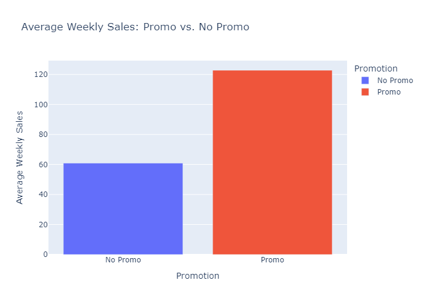
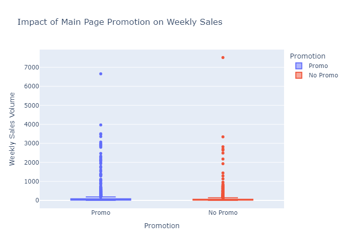

# Project Background
Micro Center, founded in 1979, is a U.S.-based electronics retailer known for its wide selection of computer hardware and consumer electronics. While the company has maintained strong in-store sales, rising competition from online-first retailers like Amazon and Newegg has pressured Micro Center to extract more value from its internal sales data to remain competitive in the evolving retail landscape.

With large volumes of historical sales data at the weekly SKU level, this project aims to uncover key performance insights that can support smarter pricing, promotion, and vendor strategies. Micro Center’s leadership has tasked the team with analyzing trends and identifying actionable insights. Micro Center has provided a limited dataset to evaluate the team's ability to generate actionable insights. If the initial findings demonstrate potential for a positive return on investment, a proposal for continued collaboration and expanded analysis will be considered.

Insights and recommendations are provided on the following key areas:

  * Sales Trends Analysis: Identifying historical weekly sales patterns and revenue changes across time to uncover seasonality, sales dips, or growth windows.

  * Price & Promotion Effects: Measuring how featured placements and price shifts affect weekly performance at the product level.

  * Vendor & SKU Performance: Highlighting which vendors consistently deliver high-performing products — and which may be underperforming.

  * Product Functionality Insights: Understanding which categories (e.g., mobile accessories, PC parts) drive the most volume and revenue.

  * Optimization Opportunities: Offering strategic next steps to improve revenue, pricing, or promotional efficiency.

The SQL queries used to inspect and clean the data for this analysis can be found here [https://github.com/SuaveAnalyst/microcenter-stakeholder-report/blob/b4c8adfa755217263b653f0d71de3bfcf86ba541/Micro%20Center%20SQL%20Ad-Hoc%20Report#L26-L175]

Targeted SQL queries regarding various business questions can be found here [https://github.com/SuaveAnalyst/microcenter-stakeholder-report/blob/de6da56e4cca384a817f6a4cacbc569685e0122c/Micro%20Center%20SQL%20Ad-Hoc%20Report#L318-L343]

# Business Questions Visualized
Price & Promotion Effects
 * 1.) Are promotional features (main page placements) driving higher sales volumes?
 *  
    
Vendor & SKU Performance
 * 2.) Which vendors consistently provide top-performing products?

Product Functionality Insights
 * 3.) What product functionalities drive the most revenue?

Sales Trends Analysis
 * 4.) How does product price impact weekly sales performance over time?

Sales Trends Analysis
 * 5.) What are the peak sales periods across the year?

Optimization Opportunities: Strategic recommendations will be derived by analyzing trends.

# Data Structure & Initial Checks

The companies main database structure as seen below consists of one tables: SKU inventory, with a total row count of 4400 records and 8 columns. A description of each table is as follows:
Table Name: Micro_Center

This table contains weekly sales records for various SKUs (products) sold by Micro Center. Each row represents a single SKU's performance during a specific week.

🧾 Table Original Schema Overview:

# Column Name       |    Datatype	        |     Description

 * week             |   DATETIME	        |     Date of the week (always set to Monday)
   
 * sku	            |   INT	                |     Unique product identifier
   
 * weekly_sales	    |   INT	                |     Number of units sold in the given week
   
 * feat_main_page   |	VARCHAR(5)	        |     Whether the product was featured on the website’s homepage (TRUE / FALSE)
   
 * color	        |   VARCHAR(6)	        |     Product color (e.g., black, red)
   
 * price	        |   NUMERIC(5,2)	    |     Weekly retail price of the product
   
 * vendor	        |   INT	                |     Encoded vendor ID (represents brand/supplier)
   
 * functionality	|   VARCHAR(31)	        |     Category or product type (e.g., Mobile phone accessories, Streaming sticks)

*********************************************************************************************************************************

                                                    Original Dataset

                                                Feature Engineered Dataset

